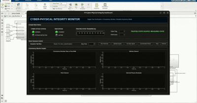

## Disclaimer

This repository contains a student research prototype developed for Airbus Fly Your Ideas 2026 concept demonstration and visualisation. It does not contain Airbus confidential information, operational aircraft data, or certified flight software. The model and scripts are intended only to demonstrate the proposed cyber-resilient flight-control architecture, real-time digital twin verification, residual monitoring, and Resilient Autonomy Mode concept.

# Cyber-Resilient Flight Control with Real-Time Digital Twin Verification

This repository contains the MATLAB/Simulink prototype for our Airbus Fly Your Ideas 2026 Round 2 submission.

The prototype demonstrates a cyber-resilient flight control architecture using a real-time physics-based digital twin, residual consistency monitoring, and Resilient Autonomy Mode (RAM).

## Files Included

- `FYI_Twin_CyberResilient.slx`  
  Main Simulink model containing the aircraft model, flight control system, digital twin, attack injection, residual monitor, and RAM logic.

- `Init_Cyber.mlx`  
  Initialization script for loading parameters and setting up the simulation workspace.

- `FYICyberDashboard.m`  
  MATLAB dashboard for visualising residuals, attack detection, and RAM response.

- `FYI_DashboardPush.m`  
  Supporting script used to push simulation data to the dashboard.

- `FYI_Workspace_Data.mat`  
  Workspace data required to run the simulation.

- `dashboard_ram_activation_demo.gif`  
  Short visual demonstration of the dashboard response during attack detection and RAM activation.

## How to Run

1. Open MATLAB.
2. Open this project folder in MATLAB.
3. Run `Init_Cyber.mlx`.
4. Open `FYI_Twin_CyberResilient.slx`.
5. Run the Simulink model.
6. Run `FYICyberDashboard_Baseline.m` to view the dashboard.

## Demonstrated Scenario

The model demonstrates a coordinated cyber manipulation scenario where GPS and air-data signals are corrupted. The digital twin predicts physically plausible aircraft behaviour, while the measured/corrupted states become inconsistent.

The residual monitor detects the inconsistency and activates Resilient Autonomy Mode, which isolates suspect data and maintains bounded safe-flight behaviour.

## Prototype Demonstration

The dashboard demonstration shows the transition from nominal operation to cyber-attack detection, residual spike response, RAM activation, trusted-state transfer, and stabilised recovery.

## Aircraft Model Baseline

The nonlinear aircraft dynamics model used in this demonstrator was developed using the DHC-2 Beaver aircraft as a baseline reference configuration. The Beaver baseline was used to define representative mass, inertia, aerodynamic, propulsion, and control-response characteristics for simulation and concept validation.

The model has been adapted for this student prototype to demonstrate cyber-resilient flight-control behaviour, real-time digital twin prediction, residual monitoring, and Resilient Autonomy Mode activation. It is not intended to represent a certified or operational aircraft model.

## Notes and Limitations

This is a student research prototype for concept demonstration and visualisation. It is not certified flight software and is not intended for operational aircraft use.

The aircraft model is a representative nonlinear simulation model based on a Beaver aircraft reference configuration. The focus of this work is not aircraft identification accuracy, but the cyber-physical resilience architecture: digital twin prediction, residual consistency monitoring, attack detection, and RAM fallback behaviour.
